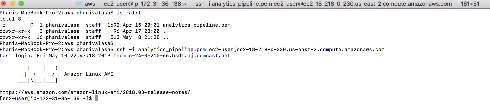
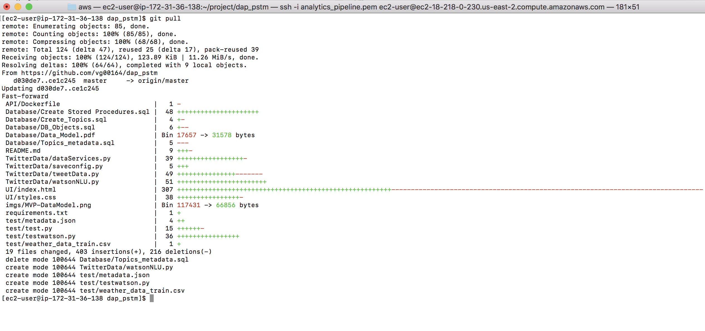
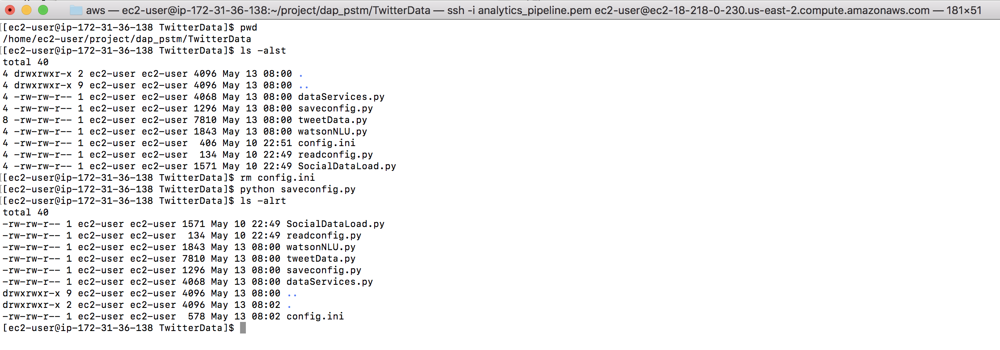
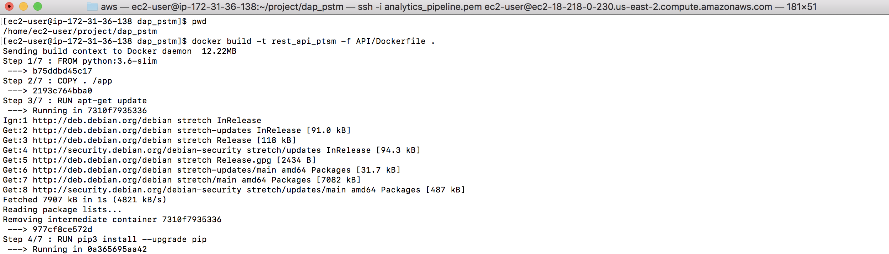
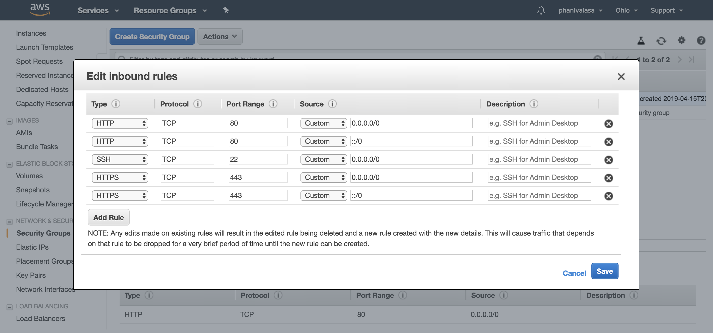
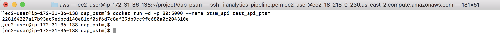
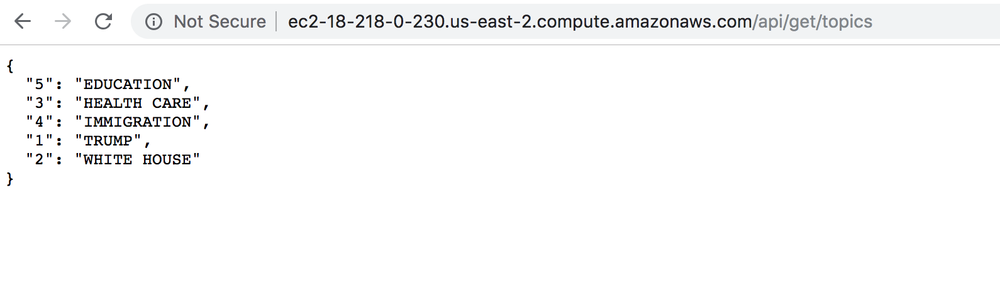
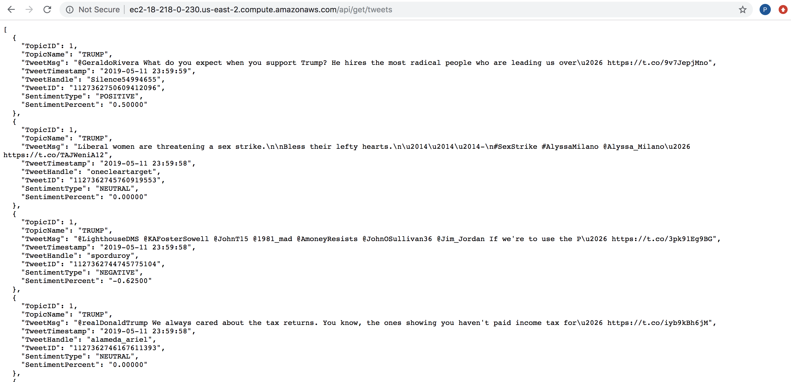
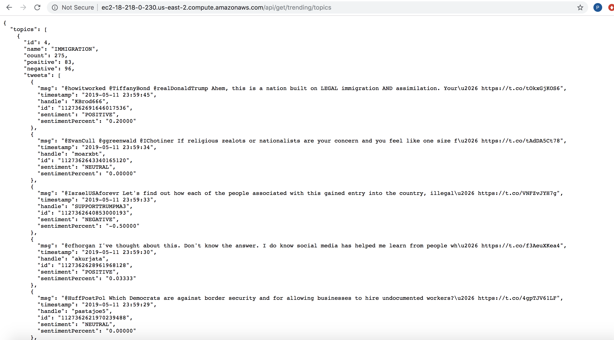

The following provides step by step instructions on building and deploying our REST API services on AWS Containers. It assumed the instance exists. There are steps shown below to clean-up unused images and stopping the existing services if exist.

### Connect to EC2 instance
Connecting to EC2 instance using (pem file) key.

### Stop the existing Docker Services
In case the services are running the container already, refer to the below to step existing docker service.

### Pull the latest code code from github to build image
The automated build and deploy is not enabled yet. Please refer to the below commands to pull the latest from git.

### Create the latest config.ini
There could be changes in the config.ini file if the file already exists on the instance. Or if it's the first time, we need to create the config.ini as it's not saved on the git. In both cases, please refer to the below creating the config.ini file.

### Clean-up unused docker images
If the docker images were created earlier, the below would help to clear unused images and reclaim some space.

### Build the docker image

### Ensure that the http and https ports (80 & 443) are open in the EC2 instance

### Run the Docker process in the background

### Invoke the services to validate.

