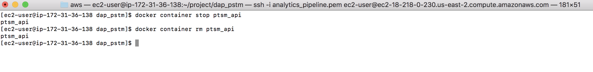

### Connect to EC2 instance

### Stop the existing Docker Services

### Pull the latest code code from github to build image

### Create the latest config.ini

### Clean-up unused docker images

### Build the docker image

### Ensure that the http and https ports (80 & 443) are open in the EC2 instance

### Run the Docker process in the background

### Invoke the services to validate.

