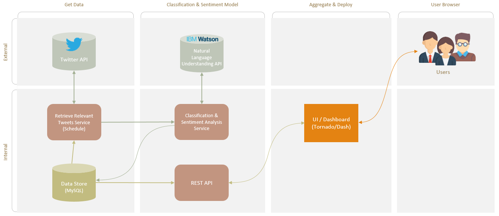

# Politics Through Social Media (DAP Project MVP)
### By Muf Tayebaly, Rohit Dalal, Phani Valasa, Venkat Gangireddy

## Objective
Provide users a smart view into popular trending topics in our growing social world and what people are talking about them near real-time.  Differentiating ourselves from news media sources.
(The current high level topic is focused on Politics for the Minimum Viable Product)

## Benefits
Aggregation of sources, like social media, in a single view while using intelligence (machine learning & natural language processing) to classify and analyze.  Providing users a new perspective on what is happening in the world on specific and hot topics.  Users can stay current without the need of reading long and single perspective news articles, saving time, and focusing on the right topics.

## How it works
We aggreegate the data from social media sources (Twitter for Sprint 1) and leverage existing ML/NLP packages to classify the content and analyze the sentiment analysis.  
As part of Sprint 1 - we monitor any tweets related to Politics and topic entities we have identify as trending right now ("Health Care", "Education", "Immigration", "Trump", "White House").  All MVP services are currently working, however, we have not completed integration to the front end Web App yet.  
Planned for Sprint 2 - Integration to the Web App using the REST API service.  Docker for easy running.  Amazon Web Services (AWS) implementation.  Smarter intelligence using IBM Watson's Natural Language Understanding (potentially).
  
### Architecture

### The Web App
Located at:  http://muftayebaly.com/apps/DAPPROJ/  

