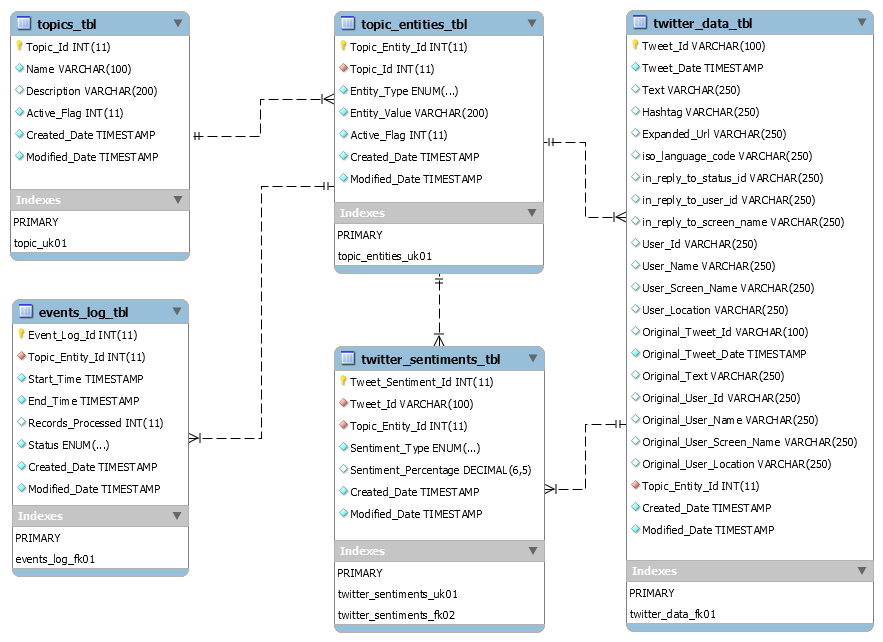
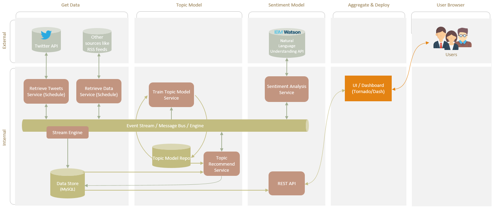

# Politics Through Social Media (DAP Project MVP)
### By Muf Tayebaly, Rohit Dalal, Phani Valasa, Venkat Gangireddy

## Objective
Provide users a smart view into popular trending topics in our growing social world and what people are talking about them near real-time.  Differentiating ourselves from news media sources.
(The current high level topic is focused on Politics for the Minimum Viable Product)

## Benefits
Aggregation of sources, like social media, in a single view while using intelligence (machine learning & natural language processing) to classify and analyze.  Providing users a new perspective on what is happening in the world on specific and hot topics.  Users can stay current without the need of reading long and single perspective news articles, saving time, and focusing on the right topics.

## How it works
We aggreegate the data from social media sources (Twitter for Sprint 1) and leverage existing ML/NLP packages to classify the content and analyze the sentiment analysis.  
As part of Sprint 1 - we monitor any tweets related to Politics and topic entities we have identify as trending right now ("Health Care", "Education", "Immigration", "Trump", "White House").  All MVP services are currently working, however, we have not completed integration to the front end Web App yet.  
Planned for Sprint 2 - Integration to the Web App using the REST API service.  Docker for easy running.  Amazon Web Services (AWS) implementation.  Smarter intelligence using IBM Watson's Natural Language Understanding (potentially).
  
### Architecture

### JIRA Board
https://toydemoproject.atlassian.net/jira/software/projects/PTSM/boards/22 

### The Web App
**Located at:**  http://muftayebaly.com/apps/DAPPROJ/ 

**Description:**  
The UI web app was built using Bootstrap as a base framework.  The design is completed using custom HTML/CSS/JS.  The files are currently hosted at the URL below and also on Github.  The UI service currently does not integrate with the REST API service to update the topics and tweets.  The integration with the REST API service will be in Sprint 2.  Only the homepage works from Sprint 1.  
  

### The REST API Service
**Located at:**  API/api.py

**Description:**  
The REST API service was built in Python using flask.  It currently runs on your local machine and leverages the dataServices DataClient in the TwitterData folder.  The service pulls the data from the MySQL database based on api GET calls and then publishes them to the user as a JSON string.

**Requirements:**  Python 3, Flask, MySql.Connector, MySQL Client, Pandas, ConfigParser, JSON, Sys

**Run by:**  In terminal, navigate to the API folder.  Use command "python api.py"
  

**Sample Inputs:**
* http://127.0.0.1:5000/api/get/tweets
* http://127.0.0.1:5000/api/get/topics
* http://127.0.0.1:5000/api/get/trending/topics  (has parameter limit that takes integer) e.g. ?limit=100
  
**Sample Outputs:**  

### The Twitter Retrieval, Classify and Sentiment Analysis Service
**Located at:**  TwitterData folder

**Description:**  
TwitterClient service provides below capabilities.  This will run on a schedule as part of Sprint 2 deliverables.
* Method: get_tweets(twitter_connection, topic_entity_id, query, size)
  * Description: This method gets the data from twitter, based on topics or entities, using the Tweepy api.
  * Input: Twitter connection handle, topic or sub topic, query and the size
  * Output: Returns the cleansed twitter data in a an array format
* Method: clean_tweet(twitter_connection, tweet)
  * Description : This method removes the special characters and returns the cleansed tweet
  * Input: Twitter connection handle, Tweet
  * Output: Tweet
* Method: get_tweet_sentiment(twitter_connection, tweet)
  * Description: This  method calls the API “textblob” to run the sentiment
  * Input: Twitter connection handle, Tweet
  * Output: Tweet with the sentiment type
* Method: main()
  * Description: This method uses twitter client and data client services to obtain the tweets, call the sentiment API and persist the output data back in the database.
  * Input: None
  * Output: None; Prints the summary of tweets to the console.

**Requirements:**  python>=3.7.2, tornado>=5.0.1, pandas>=0.23.4, mysqlclient>=1.3.13, tweepy>=3.7.0, textblob>=0.15.3

**Run by:**
* Clone this project from Github
* Move to this folder:  dap_pstm/TwitterData
* Run "python3 tweetData.py"

**Sample Output:**

### The Data Services - Data Client Service
**Located at:**  TwitterData/dataServices.py

**Description:**  
Data Services reads the configurations from the config.ini and provide below common database capabilities.
* Method: readTopics() 
  * Description: This method reads the topics metadata from topics_tbl and topics_entities_tbl
  * Input: No input required
  * Output: Topic, Topic Entities
* Method: run_query(connection, query)
  * Description: This is a common method to run any sql query to get the data from data base
  * Input: connection and sql Query
  * Output: resultset
* Method: saveDatatoDB(connection, df, table )
  * Description: This is a common method to save the python dataframe data into a database table
  * Input: connection, pandas data frame, base table
  * Output: response cursor

### The Data Store Service
**Located at:** Godaddy Server Hostname - dapproject.db.10836946.188.hostedresource.net

**Description**
Stores the necessary data into a MySQL database for later use.  Tables defined below:
* *topics_tbl* & *Topics_Entities_tbl* stores the topics and their entities which drives the Twitter API data
* *twitter_data_tbl* stores the data attributes extracted via Twitter Retrieval Service
* *twitter_sentiments_tbl* stores results of the sentiment analysis for an individual tweet. Sentiment Types:
  * POSITIVE
  * NEGATIVE
  * NEUTRAL

### The Data Model

## Big Picture (Future Aspirations)
Implementation of an event stream and a topic modeling (machine learning) service to "discover" future topics based on popularity and peoples interest (their content).
  

**Copyrighted 2019 by Columbia University**
